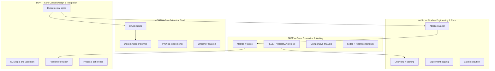

# MemFaith — Work Division and Delivery Plan
**Team:** Dev Sanghvi · Ansh Dabral · Mohamad Kreidieh · Jade Yan  
**Window:** Week of March 30, 2026 through week of April 20, 2026  
**Primary project spine:** CCS / chunk ablation on FEVER + HotpotQA  
**Extension track:** lightweight chunk scorer / discriminator trained on chunk-level causal labels  

---

## Ownership domains

---

## Team operating rule

The team should follow this hard rule:

### Rule 1 — Core before extension
The mainline CCS pipeline must stabilize before the discriminator/pruning branch becomes a first-class effort.

### Rule 2 — One source of truth
All experiments, outputs, and plots should be driven by one shared result schema and one shared config system.

### Rule 3 — No silent scope drift
If anyone starts changing the project from “chunk ablation and CCS” into “train a student from EF edits” without explicit team agreement, the project will fragment.

---

## Dev Sanghvi — Core causal design and integration lead

### Domain
Dev owns the conceptual correctness of the project and the final interpretation of the results.

### Main responsibilities
- define the final experiment contract
- lock the CCS formulation and answer-comparison logic
- review FEVER and HotpotQA protocol consistency
- supervise integration across the team
- own final result interpretation and final presentation narrative

### Week-by-week deliverables

| Week | Deliverable | Dependencies |
|---|---|---|
| Mar 30 | Finalize project spine and lock the core vs extension boundary. Approve K values, answer comparison rules, and result schema. | All |
| Apr 6 | Review first FEVER ablation outputs and validate that CCS is being computed correctly. Approve first plots and debug cases. | Ansh, Jade |
| Apr 13 | Lead comparative interpretation between FEVER and HotpotQA. Decide whether extension track should be activated. | Jade, Ansh |
| Apr 20 | Own final synthesis: conclusions, limitations, narrative coherence, and delivery-quality final pack. | All |

### Key files owned
- `docs/project_scope.md`
- `docs/experiment_contract.md`
- `analysis/final_interpretation.md`
- `analysis/case_studies.md`
- final narrative sections in proposal writeup and slides

### Non-negotiable checks owned by Dev
- Does CCS mean the same thing across all experiments?
- Are we comparing answers fairly on both datasets?
- Are the claims in the writeup matched by the actual runs?

---

## Ansh Dabral — Pipeline engineering and experiment execution lead

### Domain
Ansh owns the machinery that actually runs the ablation experiments at scale.

### Main responsibilities
- build the chunking and long-context assembly pipeline
- implement the leave-one-chunk-out runner
- cache all expensive outputs
- store all experiment records in a stable schema
- support repeatability and fast reruns

### Week-by-week deliverables

| Week | Deliverable | Dependencies |
|---|---|---|
| Mar 30 | Implement context builders, chunker, and schema for experiment logs. Produce one end-to-end smoke test on FEVER. | Jade |
| Apr 6 | FEVER ablation runner stable across K ∈ {0,2,4,8}; full-context + ablated outputs stored cleanly. | Dev |
| Apr 13 | HotpotQA runner stable, plus scripts for stratified analysis. Support optional label export for Mohamad. | Jade, Dev |
| Apr 20 | Final reproducibility scripts, run manifests, and cached result package. | All |

### Key files owned
- `src/context_builder.py`
- `src/chunker.py`
- `src/ablation_runner.py`
- `src/result_schema.py`
- `scripts/run_fever_ccs.py`
- `scripts/run_hotpotqa_ccs.py`
- `scripts/recompute_ccs_tables.py`

### Engineering requirements
- every run must be resumable
- every result must have a stable ID
- every expensive call must be cacheable
- raw outputs and normalized outputs must both be stored

---

## Mohamad Kreidieh — Chunk scorer / discriminator extension lead

### Domain
Mohamad owns the extension track, but only after the core pipeline is stable.

### Main responsibilities
- design chunk-level labels derived from the CCS pipeline
- build a lightweight chunk scorer / discriminator
- test pruning policies
- measure performance retention vs context reduction
- produce extension results if the team reaches this stage in time

### Week-by-week deliverables

| Week | Deliverable | Dependencies |
|---|---|---|
| Mar 30 | Design candidate chunk-level supervision formats: binary causal, scalar causal weight, rank-based importance. No training yet. | Dev |
| Apr 6 | Prepare extension branch only: label extraction utilities from FEVER CCS outputs. | Ansh |
| Apr 13 | If extension gate is opened, train first lightweight scorer and run pilot pruning experiments on FEVER. | Dev, Ansh |
| Apr 20 | Expand pruning results, compare retained performance vs context reduction, or if extension is not opened, package the label-generation design as future work. | Jade |

### Key files owned
- `src/label_builders/chunk_labels.py`
- `src/models/chunk_discriminator.py`
- `src/pruning/prune_context.py`
- `scripts/train_chunk_scorer.py`
- `scripts/eval_pruning.py`

### Extension gate
Mohamad should not invest full effort into model training until all three are true:
1. FEVER CCS pipeline stable
2. HotpotQA pilot stable
3. result schema finalized

---

## Jade Yan — Data protocol, evaluation, writing, and deck consistency lead

### Domain
Jade owns the dataset-level clarity, evaluation tables, and keeping the proposal/report wording aligned with what was actually implemented.

### Main responsibilities
- FEVER and HotpotQA task adaptation details
- answer comparison function documentation
- evaluation tables and metric scripts
- writeup of limitations and future work
- slide/report consistency checks

### Week-by-week deliverables

| Week | Deliverable | Dependencies |
|---|---|---|
| Mar 30 | Final dataset notes: FEVER + HotpotQA construction rules, label mapping, task comparison strategy. | Dev |
| Apr 6 | FEVER evaluation tables and first CCS plots. Draft limitations discovered from FEVER. | Ansh |
| Apr 13 | HotpotQA tables, stratified analysis, and cross-dataset comparison. Draft final results section. | Dev, Ansh |
| Apr 20 | Final polished report sections, FAQ material, slide alignment, and Q&A preparation. | All |

### Key files owned
- `docs/dataset_protocols.md`
- `src/evaluation/answer_compare.py`
- `src/evaluation/metrics.py`
- `analysis/tables_and_plots.md`
- `writing/limitations_future_work.md`
- `slides/final_notes.md`

### Special responsibility
Jade should be the person who catches wording drift like:
- “overwrite depth” vs “segmentation depth”
- “EF teacher” vs “CCS core method”
- “memory agent” vs “chunk-ablation simulation”

---

## Shared responsibilities

### Shared writing
All four contribute, but with lead ownership:
- Dev: core framing, interpretation, conclusion
- Jade: dataset/evaluation sections, limitations, future work
- Ansh: methodology implementation details
- Mohamad: extension track and pruning section

### Shared reviews
Every important PR or document section should be reviewed by one person outside the owner’s domain.

### Shared Friday integration test
Every Friday the team should run one integration meeting where the group checks:
- latest outputs
- whether files and plots are reproducible
- what is blocked
- whether the extension gate should open or remain closed

---

## Weekly sync structure

| Day | Activity | Duration |
|---|---|---|
| Monday | Scope and deliverables review | 25 min |
| Wednesday | Mid-week blockers and technical decisions | 20 min |
| Friday | Integration test + live review of outputs | 45 min |

---

## Critical handoff points

| Week | From | To | What |
|---|---|---|---|
| Mar 30 | Jade | Ansh | Clean FEVER/HotpotQA protocol definitions |
| Apr 6 | Ansh | Dev | First stable FEVER CCS outputs |
| Apr 6 | Ansh | Jade | FEVER logs for tables and plots |
| Apr 13 | Ansh | Mohamad | Chunk-level labels if extension starts |
| Apr 13 | Jade | Dev | Cross-dataset summary tables |
| Apr 20 | Everyone | Everyone | Final merged pack |

---

## RACI matrix

| Component | Dev | Ansh | Mohamad | Jade |
|---|---|---|---|---|
| Project spine / scope lock | A/R | C | C | C |
| FEVER protocol | C | C | I | A/R |
| HotpotQA protocol | C | C | I | A/R |
| Chunking utilities | C | A/R | I | C |
| Ablation runner | C | A/R | I | C |
| Result schema | C | A/R | C | C |
| CCS computation | A/R | R | I | C |
| Evaluation metrics | C | C | I | A/R |
| Analysis tables | A | C | I | R |
| Chunk label builder | C | C | A/R | I |
| Chunk scorer / discriminator | I | C | A/R | I |
| Pruning evaluation | C | C | A/R | C |
| Final interpretation | A/R | I | C | C |
| Slides / report consistency | C | I | I | A/R |

---

## Decision checkpoints

These are the decisions that must be made explicitly, not implicitly.

### Decision 1 — End of Mar 30 week
- K values finalized
- answer comparison function finalized
- mainline vs extension boundary finalized

### Decision 2 — End of Apr 6 week
- FEVER CCS stable enough?
- continue with HotpotQA immediately or reduce FEVER debugging first?

### Decision 3 — End of Apr 13 week
- is the extension gate opened?
- or is the remaining week reserved only for analysis and writing?

### Decision 4 — Start of Apr 20 week
- what exactly goes into the final pack?
- do we present extension results, or only a design plus partial prototype?

---

## Team rules for preventing duplicated effort

### Rule A
No one should build private alternate schemas. One result schema only.

### Rule B
No one should change the project framing in slides or docs without checking the core statement.

### Rule C
No extension experiment should block a core experiment.

### Rule D
Every output file should clearly indicate:
- dataset
- K
- model
- prompt / config version
- timestamp

---

## Final recommendation

The cleanest way to use the team is:
- **Dev** keeps the whole project logically correct
- **Ansh** makes the pipeline actually run
- **Jade** makes the evaluation and writing precise
- **Mohamad** gives the project a systems extension if time allows

That split is balanced and minimizes people feeling like they are “working for someone else’s startup,” because the project remains an academic causal-faithfulness system first, with the pruning extension only as a secondary system contribution.

